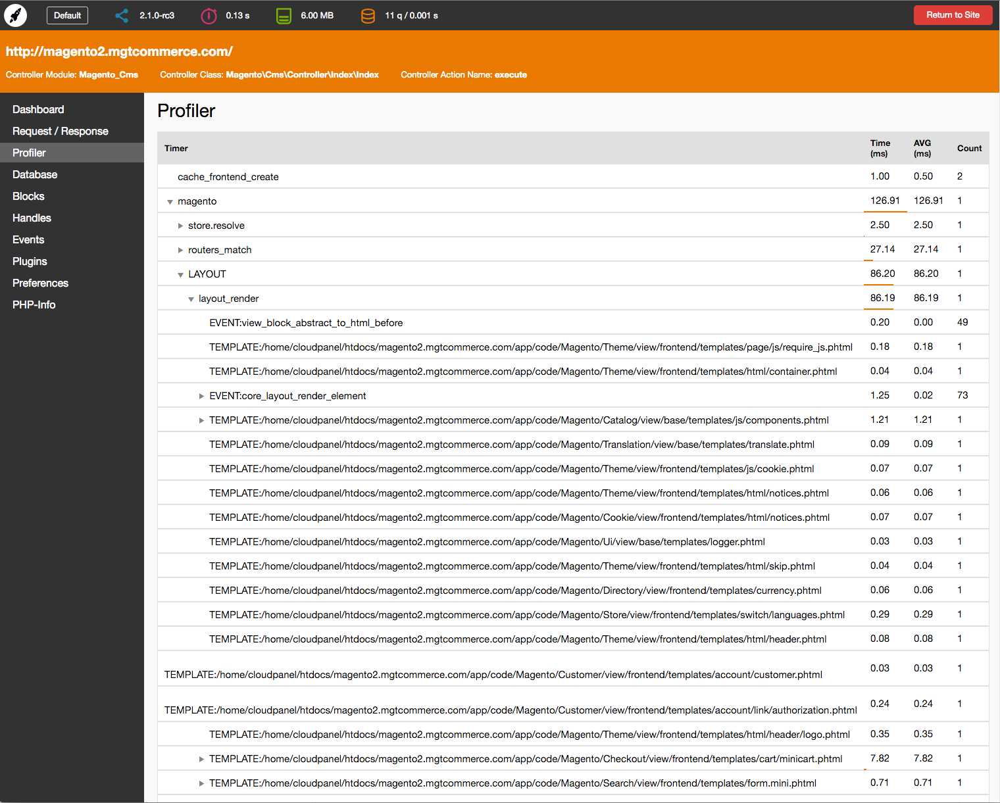

Developer Toolbar for Magento 2
============================

The MGT Developer Toolbar is a must have for Magento 2 developers and frontend guys.
The toolbar shows you all important information for performance optimisation and module development.

## Main Features

* PHP Parse Time / Profiler
* Memory Consumption
* List of all Database Queries
* Block nesting
* Cache storage information
* Session storage information
* Enabled / Disabled Modules
* Request / Response Data
* Handles
* Events / Observers
* Plugins
* Preferences
* PHP-Info

## Installation with Composer

* Connect to your server with SSH
* Navigation to your project and run these commands

composer config repositories.mgt-developertoolbar vcs https://github.com/mgtcommerce/Mgt_Developertoolbar.git

composer require mgtcommerce/module-mgtdevelopertoolbar:dev-master