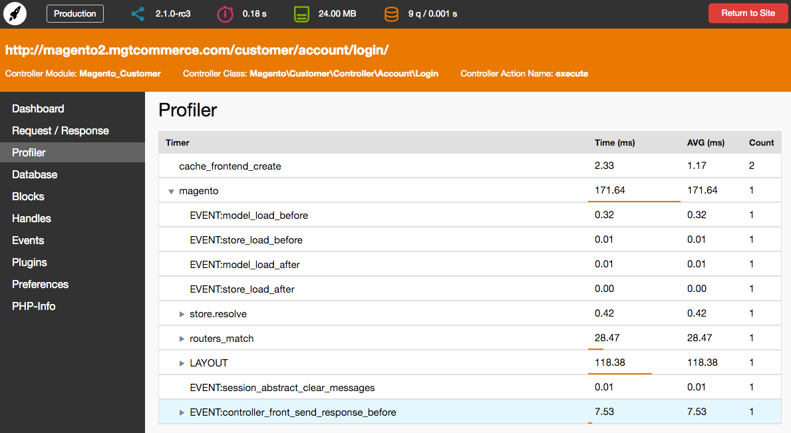
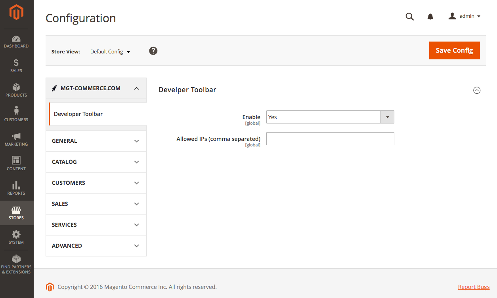
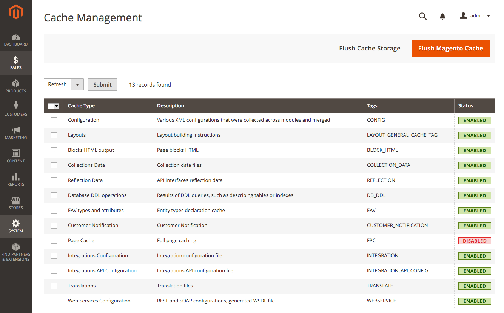
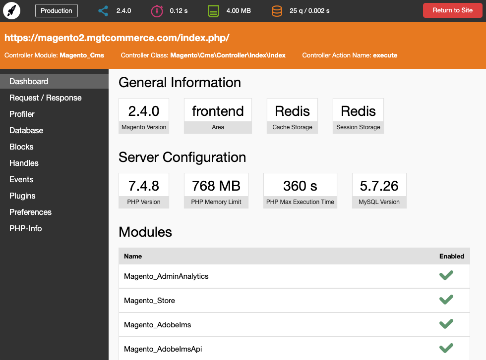
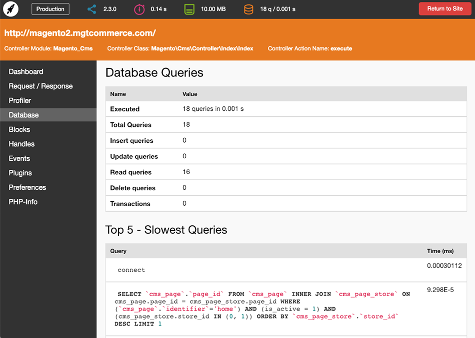
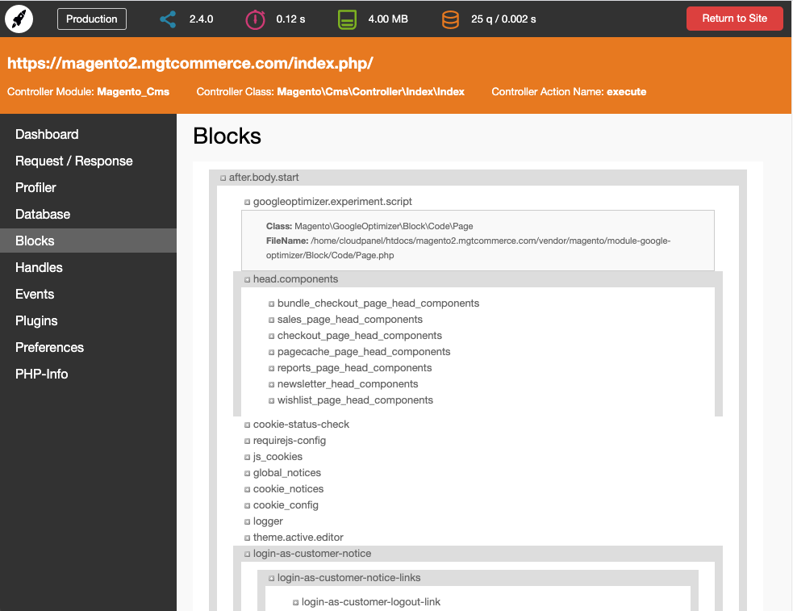

Mgt Developer Toolbar for Magento 2
============================

The Mgt Developer Toolbar is a must have for Magento 2 developers and frontend guys.
The toolbar shows you all important information for performance optimisation and magento development.



## Main Features

* Profiler
* Memory Consumption
* List of all Database Queries
* Block nesting
* Cache Storage Information
* Session Storage Information
* Enabled / Disabled Modules
* Request / Response Data
* Handles
* Events / Observers
* Plugins
* Preferences
* PHP-Info

## Installation with Composer

* Connect to your server with SSH
* Navigation to your project and run these commands
 
```bash
composer require mgtcommerce/module-mgtdevelopertoolbar

php bin/magento setup:upgrade
rm -rf pub/static/* 
rm -rf var/*

php bin/magento setup:static-content:deploy
```

## Installation without Composer

* Download the files from github: https://github.com/mgtcommerce/Mgt_Developertoolbar/archive/master.zip
* Extract archive and copy all directories from src/app/code/ to app/code/
* Go to project home directory and execute these commands

```bash
php bin/magento setup:upgrade
rm -rf pub/static/* 
rm -rf var/*

php bin/magento setup:static-content:deploy
```


## Usage

To enable / disable the toolbar go to Stores --> Configuration --> MGT-COMMERCE.COM --> Developer Toolbar



Make sure to have the Full Page Caching (FPC) disabled otherwise the toolbar will not work



## Screenshots

Dashboard



Profiler


Database Queries



Nested Blocks



## Licence
[Open Software License (OSL 3.0)](http://opensource.org/licenses/osl-3.0.php)
