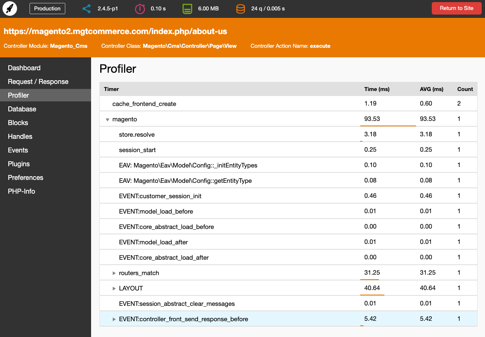

MGT Developer Toolbar for Magento 2
============================

The [MGT Developer Toolbar](https://www.mgt-commerce.com/docs/mgt-developer-toolbar/magento2/introduction) is a 
must-have for Magento 2 developers and frontend guys.
The toolbar shows you all important information for performance optimisation and Magento development.

## Main Features

* Profiler
* Memory Consumption
* List of all Database Queries
* Block nesting
* Cache Storage Information
* Session Storage Information
* Enabled / Disabled Modules
* Request / Response Data
* Handles
* Events / Observers
* Plugins
* Preferences
* PHP-Info

## Installation

Follow the [Documentation](https://www.mgt-commerce.com/docs/mgt-developer-toolbar/magento2/installation) for detailed installation instructions.